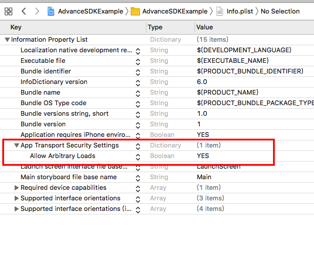

# iOS_ServerBidSDK

<font size = "5">**版本号：v1.0.0.0**

## 背景

倍业ServerBidding实现方案, 目前支持 穿山甲, 广点通, 快手, MercurySDK

## 1. 接入前

- 请联系相关的运营或商务人员确认资质并进行注册，在平台审核通过后,会分配聚合id及广告位id。

- iOS_ServerBidSDK 与AdvanceSDK 不能同时接入, 请在开发前与相关人员确认接入方案

## 2.AdServerBidSDK v1.0.0.0支持渠道平台信息

| SDK渠道平台: |  兼容版本号|  SDK标识 ID |
|:-------------| :---------------|  :---------------| 
| Mercury|v3.1.8.4 | "1000" |
|穿山甲 |v4.9.0.6|  "1001"|
|广点通 |  v4.14.10 | "1002"| 
| 快手 | v3.3.36|  "1003" |

**注意:** AdServerBidSDK目前只支持开屏广告位


## 3. 开发环境

确保您的开发及部署环境符合以下标准：

- 开发工具：推荐Xcode 13及以上版本
- 部署目标：iOS 10.0及以上版本

## 4. 权限申请及说明

- AdServerBidSDK本身并不需要任何权限, 但聚合的渠道中如果要求索取某些权限, 则媒体需要添加相应权限

- 添加 App Tracking Transparency 权限，请更新您的 Info.plist，添加 NSUserTrackingUsageDescription 字段和自定义文案描述。代码示例：

```
<key>NSUserTrackingUsageDescription</key>
<string>该标识符将用于向您投放个性化广告</string>
```

> **注意:** 调试阶段尽量使用真机, 以便获取idfa, 如果获取不到idfa, 则打开idfa开关, iphone 打开idfa 开关的的过程:设置 -> 隐私 -> 跟踪 -> 允许App请求跟踪

- 将穿山甲和广点通的 SKAdNetwork ID 添加到 info.plist 中，以保证 SKAdNetwork 的正确运行

```
<key>SKAdNetworkItems</key>
  <array>
    <dict>
      <key>SKAdNetworkIdentifier</key>
      <string>238da6jt44.skadnetwork</string>
    </dict>
    <dict>
      <key>SKAdNetworkIdentifier</key>
      <string>22mmun2rn5.skadnetwork</string>
    </dict>
    <dict>
      <key>SKAdNetworkIdentifier</key>
      <string>f7s53z58qe.skadnetwork</string>
    </dict>
    <dict>
      <key>SKAdNetworkIdentifier</key> 
      <string>r3y5dwb26t.skadnetwork</string>
    </dict>
  </array>
```

- 网络配置（必须)

苹果公司在iOS9中升级了应用网络通信安全策略，默认推荐开发者使用HTTPS协议来进行网络通信，并限制HTTP协议的请求，sdk需要app支持http请求：



## 5.Cocoapods导入


打开Podfile文件，应该是如下内容（具体内容可能会有一些出入）：

```
# platform :ios, '9.0'
target '你的项目名称' do
  # use_frameworks!
  # Pods for 你的项目名称
end
```

修改Podfile文件，将pod 'AdServerBidSDK'添加到Podfile中，如下所示：

```
platform :ios, '9.0'
target '你的项目名称' do
  # use_frameworks!
  # Pods for 你的项目名称
  pod 'AdServerBidSDK', '~> 1.0.0.0' # 可指定你想要的版本号
  pod 'AdServerBidSDK/Mercury'  # 必须添加
  pod 'AdServerBidSDK/CSJ', 	# 必须添加
  pod 'AdServerBidSDK/GDT', 	# 必须添加
# pod  'AdServerBidSDK/KS' # 如果需要导入快手广告则添加 如果不需要则不添加 看需求选择是否添加

end
```

运行命令进行安装：

```
$ pod install --repo-update
```

## 6. 开发

### 6.1 全局初始化设置(必须)

**appId必须要在具体广告位初始化之前设置**

```
- (BOOL)application:(UIApplication *)application didFinishLaunchingWithOptions:(NSDictionary *)launchOptions {

    ...
    // 设置appid
    [AdvSdkConfig shareInstance].appId = @"your appId";    
    return YES;
}
```

### 6.2 各广告接口说明及示例

#### 6.2.1 开屏广告位

| 属性| 	介绍|
|--------- |---------------|  
|showLogoRequire |是否展示Logo 默认: NO <br>**注意:** 设置logoImage时 该属性需置为YES 避免出现素材高度不足时下方留白的情况| 
|logoImage |广告Logo, 建议设置此属性 <br>**注意:** <br>1: showLogoRequire = YES时,必须设置logoImage<br>2: logo图片不应该是仅是一张透明的图片icon 应该是一张有背景的logo, 且宽度为屏幕宽度, 高度等于你设置的logo整体高度<br>3: 如果想对logo布局定制化, 只许将自定义底部view转成UIImage然后赋给logoImage属性,具体请参照demo中的-createLogoImageFromView 方法| 
|backgroundImage |广告未加载出来时的占位图| 
|viewController |控制器| 
|timeout |总超时时间,如果该时间内没有广告曝光,则强制移除开屏广告| 


| 代理方法| 	介绍|
|--------- |---------------|  
|- (void)adServerBidOnAdReceived:(NSString *)reqId | 策略请求成功回调<br> reqId : 聚合策略请求的唯一标识|  
|- (void)adServerBidFailedWithError:(NSError *)error description:(NSDictionary *)description | 广告请求失败<br>description:详细原因|  
|- (void)adServerBidSupplierWillLoad:(NSString *)supplierId | 内部渠道将要加载时调用<br> supplierId :将要加载的渠道id|  
|- (void)adServerBidExposured |广告曝光成功|
|- (void)adServerBidClicked |广告点击回调|
|- (void)adServerBidUnifiedViewDidLoad |广告数据请求成功后调用|
|- (void)adServerBidDidClose |广告关闭的回调|
|- (void)adServerBidSplashOnAdSkipClicked |广告点击跳过|
|- (void)adServerBidSplashOnAdCountdownToZero |广告倒计时结束回调|

**注意事项:**

- 超时时间只需要设置AdServerBidSplash的 timeout属性, 如果在timeout时间内没有广告曝光, 则会强制移除开屏广告,并触发错误回调

- 每次加载需开屏广告需使用最新的实例, **不要使用懒加载**, 不要进行本地存储, 或计时器持有的操作

- 保证在开屏广告生命周期内(包括请求,曝光成功后的展现时间内),不要更换rootVC, 也不要对Window进行操作

- 不要手动调用 -deallocAdapter 方法, 该方法为SDK内部调用


```
#import "DemoSplashViewController.h"

#import <AdServerBidSDK/AdServerBidSplash.h>
#import <objc/runtime.h>
#import <objc/message.h>

@interface DemoSplashViewController () <AdServerBidSplashDelegate>
@property(strong,nonatomic) AdServerBidSplash *adServerBidSplash;

@property (nonatomic, strong) NSLock *lock;

@end

@implementation DemoSplashViewController

- (void)viewDidLoad {
    [super viewDidLoad];
    /**
     - 超时时间只需要设置AdServerBidSplash的 timeout属性, 如果在timeout时间内没有广告曝光, 则会强制移除开屏广告,并触发错误回调

     - 每次加载需开屏广告需使用最新的实例, 不要进行本地存储, 或计时器持有的操作

     - 保证在开屏广告生命周期内(包括请求,曝光成功后的展现时间内),不要更换rootVC, 也不要对Window进行操作

     */
    // demo 中的id 为开发环境id
    // 需要id调试的媒体请联系运营同学开通
    self.initDefSubviewsFlag = YES;
    self.adspotIdsArr = @[
        @{@"addesc": @"SeverBidding开屏测试", @"adspotId": @"000000-10007093"},


//
    ];
    self.btn1Title = @"加载并显示广告";
}

- (void)loadAdBtn1Action {
    if (![self checkAdspotId]) { return; }
    
    if (self.adServerBidSplash) {
        self.adServerBidSplash.delegate = nil;
        self.adServerBidSplash = nil;
    }
    
    // 每次加载广告请 使用新的实例  不要用懒加载, 不要对广告对象进行本地化存储相关的操作
    self.adServerBidSplash = [[AdServerBidSplash alloc] initWithAdspotId:self.adspotId
                                                       customExt:@{} viewController:self];

    self.adServerBidSplash.isUploadSDKVersion = YES;
    self.adServerBidSplash.delegate = self;
    
    /**
      logo图片不应该是仅是一张透明的logo 应该是一张有背景的logo, 且高度等于你设置的logo高度
     
      self.adServerBidSplash.logoImage = [UIImage imageNamed:@"app_logo"];

     */
    
    // 如果想要对logo有特定的布局 则参照 -createLogoImageFromView 方法
    // 建议设置logo 避免某些素材长图不足时屏幕下方留白
    self.adServerBidSplash.logoImage = [self createLogoImageFromView];
    // 设置logo时 该属性要设置为YES
    self.adServerBidSplash.showLogoRequire = YES;

    self.adServerBidSplash.backgroundImage = [UIImage imageNamed:@"LaunchImage_img"];
    // 如果开发者有自己的超时时间限制 那timeout 应该比 开发者 最好比自己的超时时间限制要短
    // 当到达 timeout 后 不出广告adServerBidSplash内部会强制移除广告的不需要开发者手动移除
    self.adServerBidSplash.timeout = 5;//<---- 确保timeout 时长内不对adServerBidSplash进行移除的操作
    [self.adServerBidSplash loadAd];

}


- (UIImage*)createLogoImageFromView

{
    // 在这个方法里你可以随意 定制化logo
   // 300 170
    
    CGFloat width = self.view.frame.size.width;
    
    UIView *view = [[UIView alloc] initWithFrame:CGRectMake(0, 0, width, 120)];
    view.backgroundColor = [UIColor blueColor];
    UIImageView *imageV = [[UIImageView alloc]initWithImage:[UIImage imageNamed:@"app_logo"]];
    [view addSubview:imageV];
    imageV.frame = CGRectMake(0, 0, 100 * (300/170.f), 100);
    imageV.center = view.center;
    
//obtain scale
    CGFloat scale = [UIScreen mainScreen].scale;

    UIGraphicsBeginImageContextWithOptions(CGSizeMake(view.frame.size.width,
                                                      120), NO,scale);
    [view.layer renderInContext:UIGraphicsGetCurrentContext()];
    
    //开始生成图片
    UIImage* image = UIGraphicsGetImageFromCurrentImageContext();
    UIGraphicsEndImageContext();
    return image;
}

- (NSLock *)lock {
    if (!_lock) {
        _lock = [NSLock new];
    }
    return _lock;
}


// MARK: ======================= AdServerBidSplashDelegate =======================

/// 广告数据拉取成功
- (void)adServerBidUnifiedViewDidLoad {
    NSLog(@"广告数据拉取成功 %s", __func__);
//    [self loadAdBtn1Action];

}

/// 广告曝光成功
- (void)adServerBidExposured {
    NSLog(@"广告曝光成功 %s", __func__);
}

/// 广告加载失败
- (void)adServerBidFailedWithError:(NSError *)error description:(NSDictionary *)description{
    NSLog(@"广告展示失败 %s  error: %@ 详情:%@", __func__, error, description);
    self.adServerBidSplash.delegate = nil;
    self.adServerBidSplash = nil;

}
/// 内部渠道开始加载时调用
- (void)adServerBidSupplierWillLoad:(NSString *)supplierId {
    NSLog(@"内部渠道开始加载 %s  supplierId: %@", __func__, supplierId);

}
/// 广告点击
- (void)adServerBidClicked {
    NSLog(@"广告点击 %s", __func__);
}

/// 广告关闭
- (void)adServerBidDidClose {
    NSLog(@"广告关闭了 %s", __func__);
    self.adServerBidSplash.delegate = nil;
    self.adServerBidSplash = nil;

}

- (void)dealloc {
    NSLog(@"%s",__func__);
    self.adServerBidSplash.delegate = nil;
    self.adServerBidSplash = nil;
}

/// 广告倒计时结束
- (void)adServerBidSplashOnAdCountdownToZero {
    NSLog(@"广告倒计时结束 %s", __func__);
}

/// 点击了跳过
- (void)adServerBidSplashOnAdSkipClicked {
    NSLog(@"点击了跳过 %s", __func__);
}

// 策略请求成功
- (void)adServerBidOnAdReceived:(NSString *)reqId
{
    NSLog(@"%s 策略id为: %@",__func__ , reqId);
}

```


